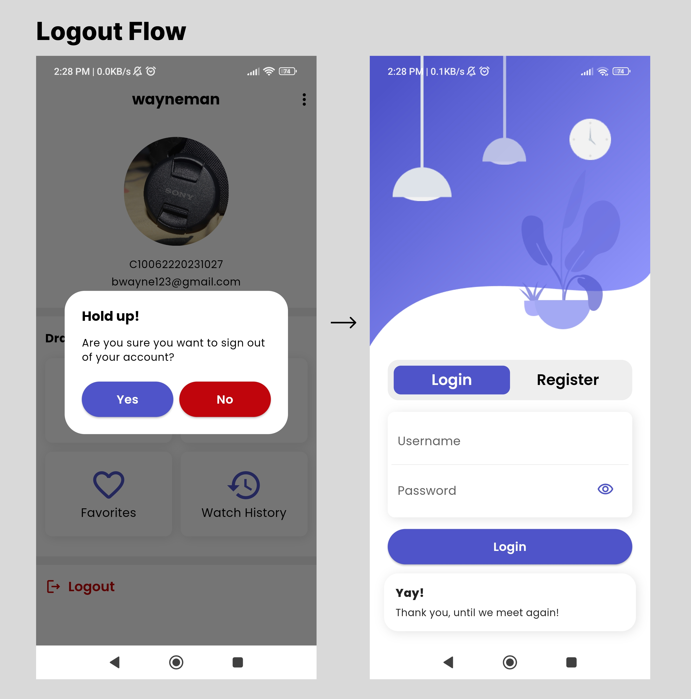

# Cek-LPSE-Pre-Test-Mobile-Dev-Client-App-Dev

## Deskripsi
Hasil pengerjaan "Pre-Test Mobile Dev Recruitment Cek LPSE". Aplikasi yang dibuat bersifat Full Stack dan menerapkan konsep CRUD secara keseluruhan karena terdapat fitur - fitur:
1. Register (Create)
2. Login & Get Profile (Read)
3. Update Profile & Profile Picture (Update)
4. Delete Account (Delete)

## Tech Stack
### Front End ([.apk File](https://drive.google.com/file/d/1jdlsCZJx7wH2E0nbn3ERxhFlDqgy7BS4/view?usp=sharing))
- Framework/Language          : Flutter/Dart
- State Management            : GetX
- HTTP Client                 : Dio
- Local Storage               : Get Storage
- Miscellaneous               : Get CLI

### Back End ([Repo](https://github.com/rizkiazka99/Cek-LPSE-Pre-Test-Mobile-Dev-Back-End) & [.env File](https://drive.google.com/file/d/1PtD635OgQ_x5qvkLN8_CC6hkeK2lleC3/view?usp=sharing))
- Framework/Language          : Node.js & Express.js/JavaScript
- ORM                         : Sequelize
- Database                    : PostgreSQL
- Authentication              : Json Web Token (JWT)
- Encryption                  : bcrypt
- File Upload                 : Multer
- Hosting Service(s)          : Glitch (API) & Supabase (Database)

## Screenshots
1. Splash Screen

2. Auth Screen - Login

3. Auth Screen - Register

4. Home Screen

5. Log Out

6. Update Profile

.png>)

7. Delete Account

8. Other Pages
